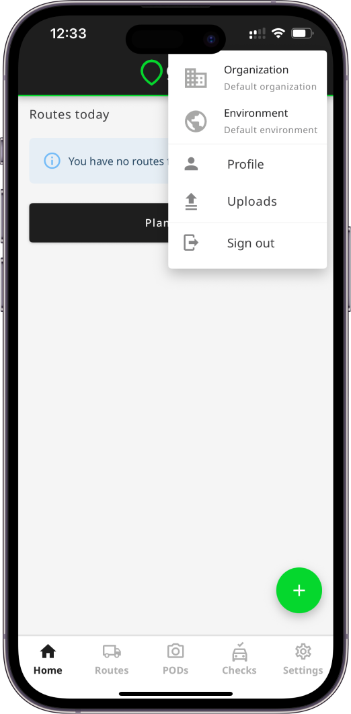
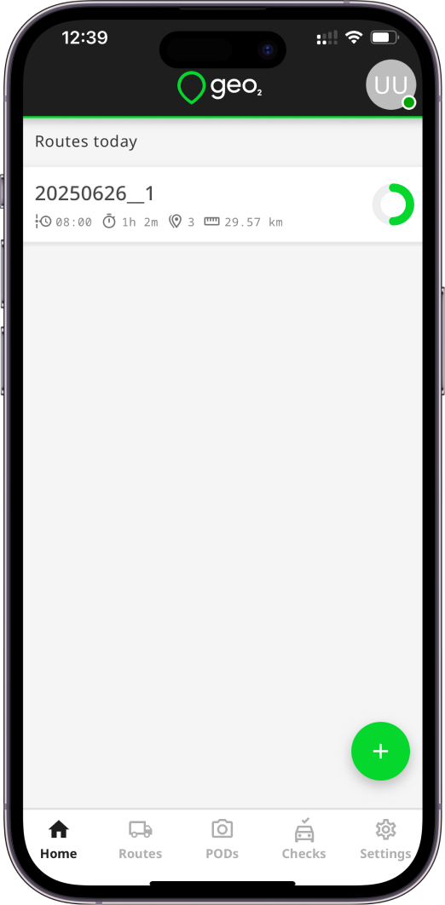
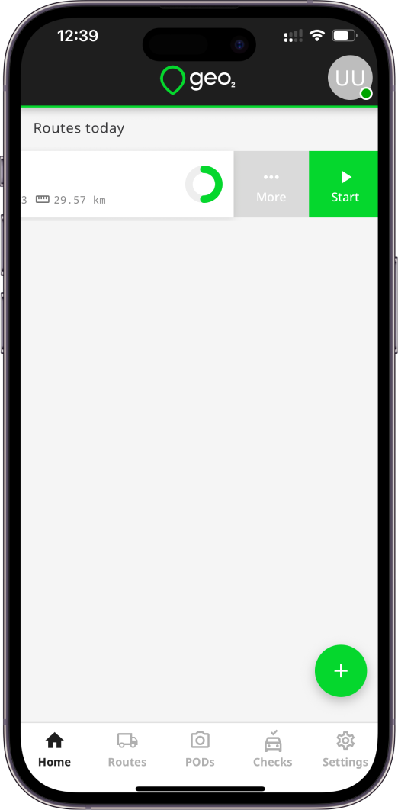
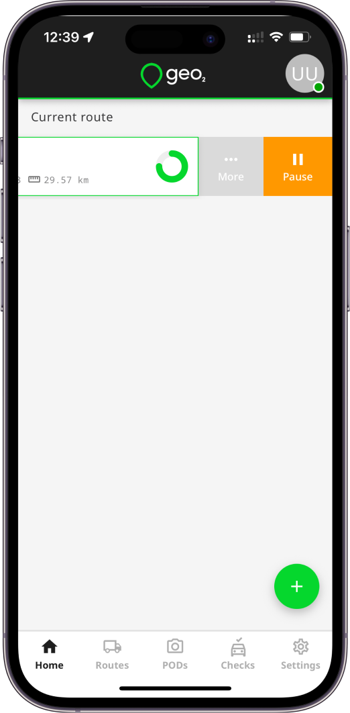
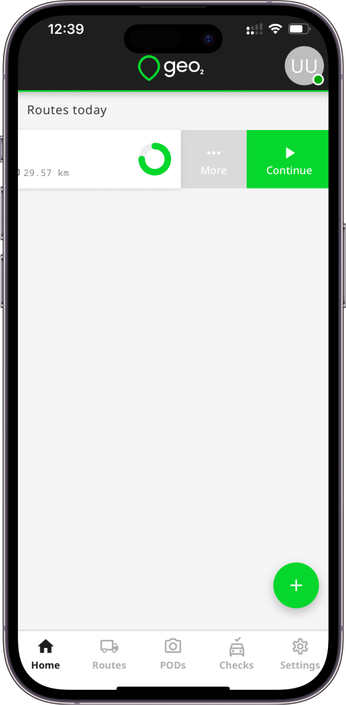
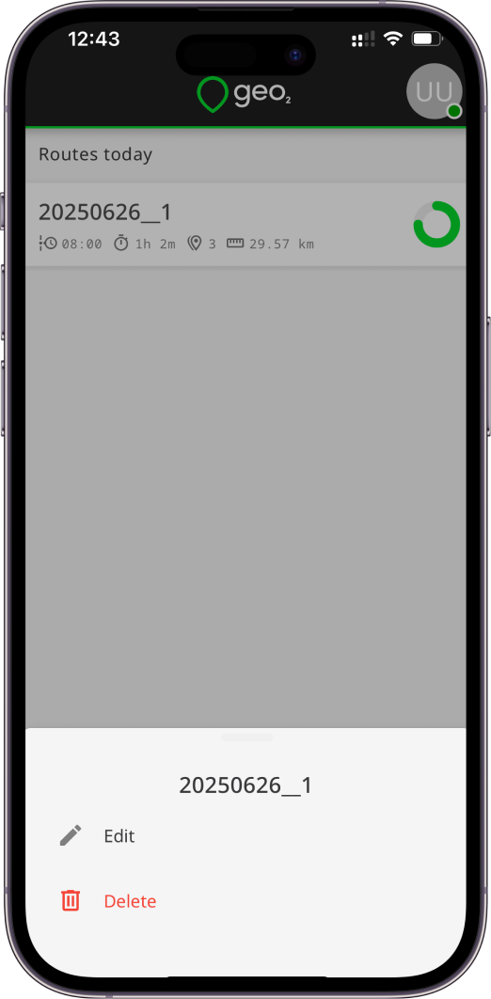
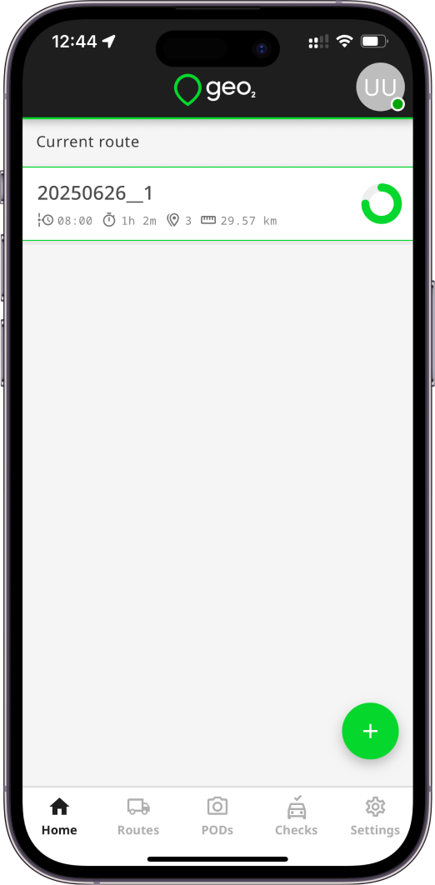
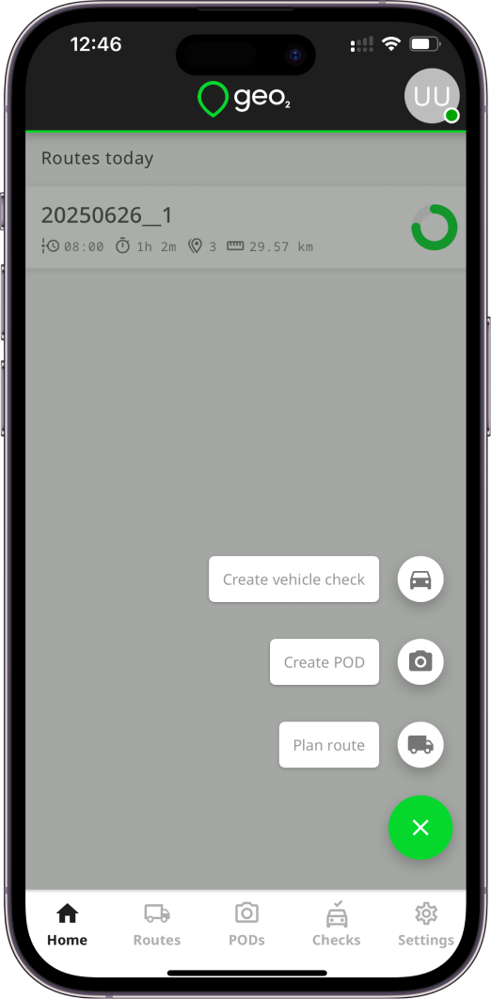

[Mobile App](../Mobile%20App.md)

# Mobile App: Home

- [Introduction](#introduction)
- [Profile Menu](#profile-menu)
- [Assigned Routes](#assigned-routes)
- [Create Route](#create-route)
- [Create POD](#create-pod)
- [Create Vehicle Check](#create-vehicle-check)
- [In This Section](#in-this-section)

# Introduction

You will see Home page once you have signed in successfully. You may be invited to join other organizations.  To [Hub: Accept Invitation](../Web-Based%20Hub/Hub_%20Accept%20Invitation.md), [Mobile App: Sign In](Mobile%20App_%20Sign%20In.md) to the app using the email address to which the invitation has been sent.  If you are not invited to any organization, the default organization will be created. **Free level subscription** will be assigned to you, **no card required**.

# Profile Menu

In the upper-right corner of the page by clicking on the Profile menu, you can access your profile information, view/select the Geo2 organization and environment you are working in, re-upload photos to POD’s and vehicle checks, and sign out.

# Assigned Routes

On Home page, you can check the routes assigned to you for today. You can swipe left over the route and click on the `Start` button to start the route.  Later, the `Start` button is replaced with the `Pause` button to temporarily pause the route (location tracking for this route will be paused).  To continue the route again, press the `Continue` button. 

By swiping left over the route or using the long press, you can also click on the `More` buttons to open the dialog with the following options: Edit, Delete.  You can create, edit, and delete routes only if you have permission to do it - Manager or Admin role in the current environment.

Once some route is started, on Home page you will see only the Current route that is started.

# Create Route

On Home page, by clicking on the `+ (Plus)` or `Plan route` button, you can choose to create a route if you have permission to do it.  Check more details about [**creating routes**](https://balloonone.atlassian.net/wiki/display/BALDEVGEO/Mobile+App%3A+Loads#MobileApp:Loads-CreateLoad).

# Create POD

On Home page, by clicking on the `+ (Plus)` button, you can choose to create ad-hoc POD.  Check more details about [**creating unplanned POD's**](#creating-unplanned-pod-s).

# Create Vehicle Check

On Home page, by clicking on the `+ (Plus)` button, you can choose to create ad-hoc vehicle check.  Check more details about [Mobile App: Vehicle Checks](Mobile%20App_%20Vehicle%20Checks.md).

# In This Section

- [Mobile app: Organization and Environment](Mobile%20App_%20Home/Mobile%20app_%20Organization%20and%20Environment.md)
- [Mobile App: Profile](Mobile%20App_%20Home/Mobile%20App_%20Profile.md)
- [Mobile App: Language](Mobile%20App_%20Home/Mobile%20App_%20Language.md)
- [Mobile app: Pending Uploads](Mobile%20App_%20Home/Mobile%20app_%20Pending%20Uploads.md)
