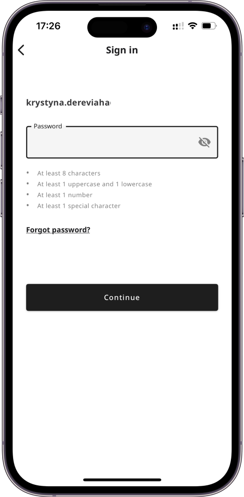
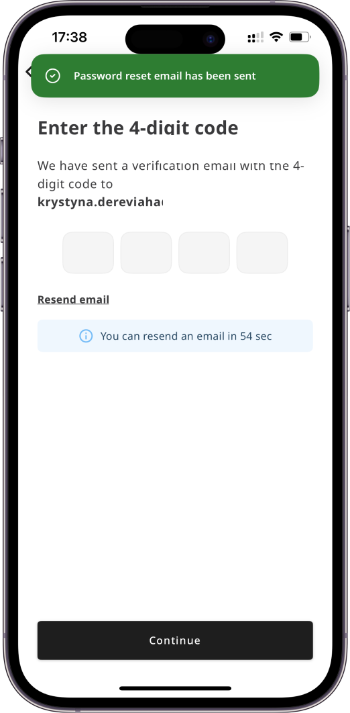
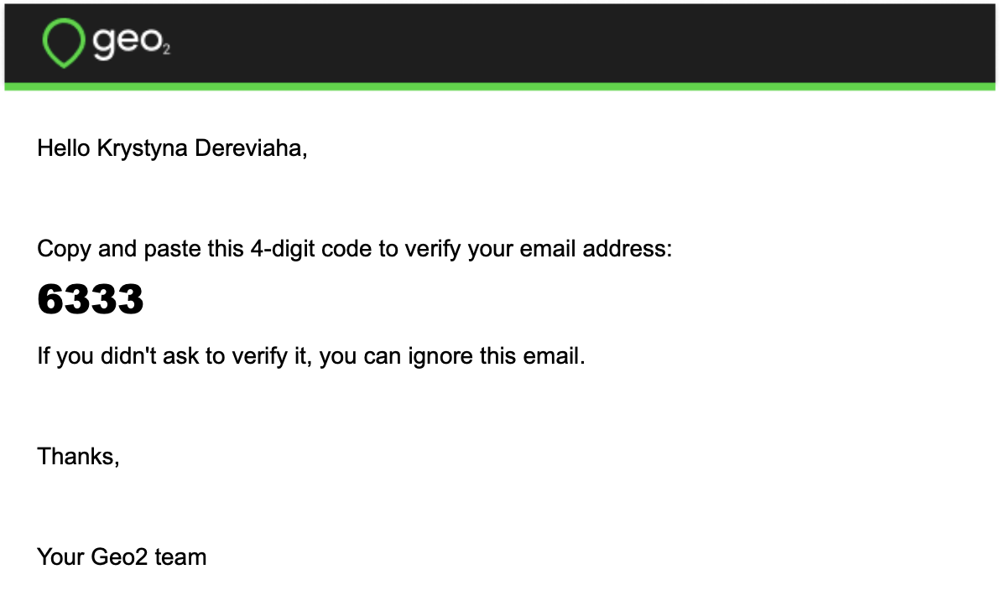
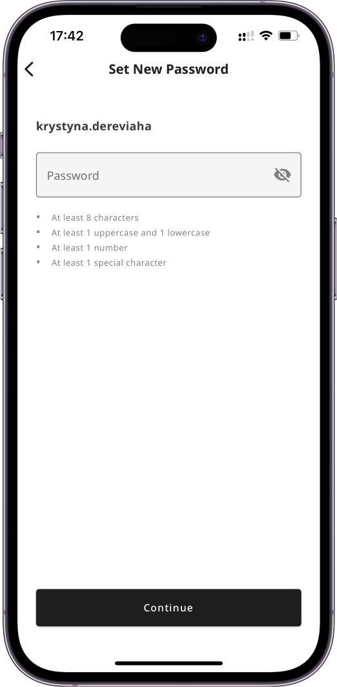

[Mobile App](../../Mobile%20App.md) > [Mobile App: Sign In](../Mobile%20App_%20Sign%20In.md)

# Mobile App: Forgot Password

If you have forgotten your password and cannot sign in successfully using your email address, follow the link `Forgot password?` on Sign in page.  This will enable you to reset your Geo2 password.

You will see a prompt for you to check your inbox for a verification code sent to the provided email address. You need to copy the code and paste it to the form in the mobile app:

If you have not received an email with a verification code, press the `Resend email` button, and a new code will be sent. Once your email is verified, you can set a new password.  Your password has to contain at least 8 characters, 1 uppercase and lowercase, 1 number, and 1 special character.

By pressing the `Continue` button, you will be logged in and redirected to Dashboard page, your password will be saved. A confirmation will appear:

You can use it to sign in to the mobile app.
