[Mobile App](../Mobile%20App.md)

# Mobile App: Vehicle Checks

- [Enabling Vehicle Checks for Route](#enabling-vehicle-checks-for-route)
- [Vehicle Check Creation for Route](#vehicle-check-creation-for-route)
- [Unplanned/Ad-hoc Vehicle Check](#unplanned-ad-hoc-vehicle-check)
- [Vehicle Checks History](#vehicle-checks-history)
- [Custom Vehicle Checks Fields](#custom-vehicle-checks-fields)

# Enabling Vehicle Checks for Route

You can activate Vehicle checks on the mobile app when the route is being started and completed in Environment settings in Geo2 Hub.  By default, these options are enabled but you can change it anytime. 

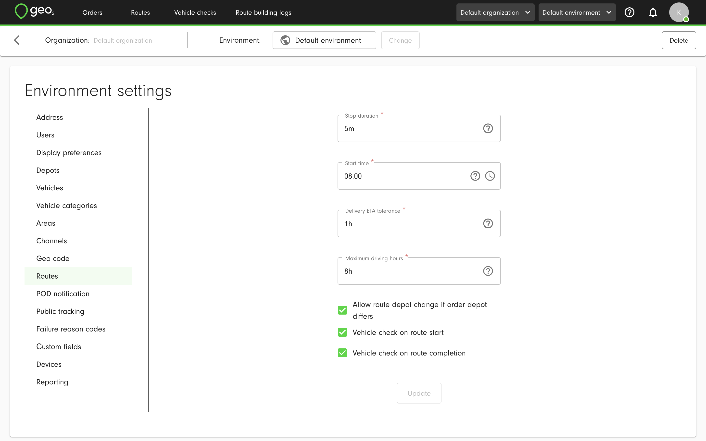

Even though vehicle checks are enabled or disabled in Environment settings, it is possible to manage vehicle checks for an individual route on Create/Edit route and Route plan pages.

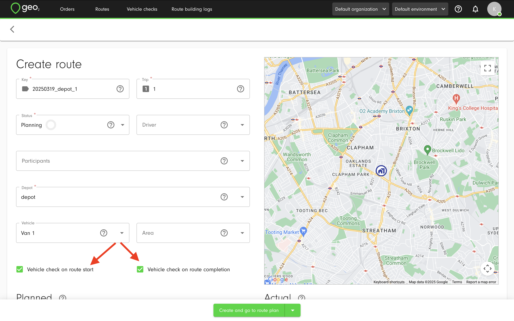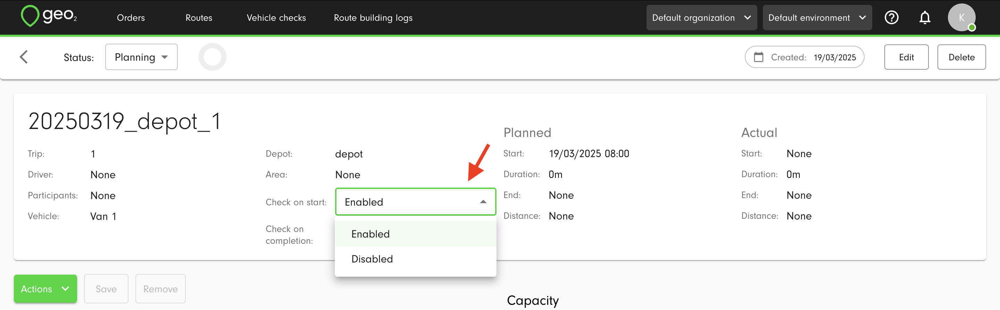

# Vehicle Check Creation for Route

If Vehicle checks are enabled in Geo2 Hub, Vehicle check creation page will be displayed every time the route is started and completed.  See how to create a vehicle check:

[Mob Vehicle check creation.mp4](/wiki/download/attachments/27593284/Mob%20Vehicle%20check%20creation.mp4?version=1&modificationDate=1709638576343&cacheVersion=1&api=v2)

If the geolocation is turned off, you will be asked to turn it on for the Vehicle check creation but you can create it without geolocation.

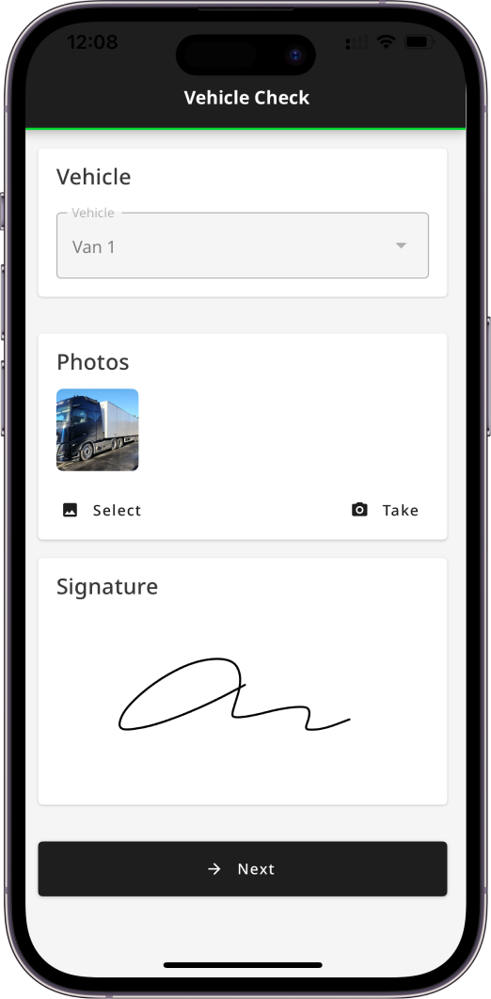

For the Vehicle check creation, you need to take or select photos of the vehicle (optional) and create a signature (optional).  Remember to save it.  If a vehicle is specified for a route, it will be displayed on Create vehicle check page and it is not possible to edit it.  If there is no vehicle provided for a route, you will be asked to select a vehicle existing in your environment settings for which you want to create this check.

To complete the creation, press the `Next` button.

# Unplanned/Ad-hoc Vehicle Check

To create an unplanned/ad-hoc vehicle check that is not related to any route, you can press the `+ (Plus)` button on Dashboard page or Checks pages and select the `Create vehicle check` option.

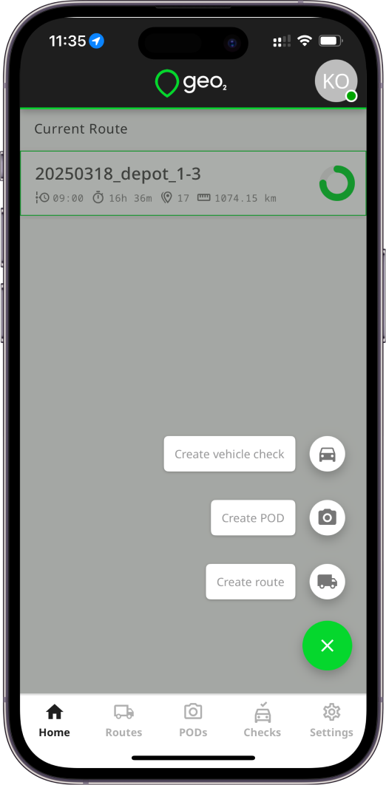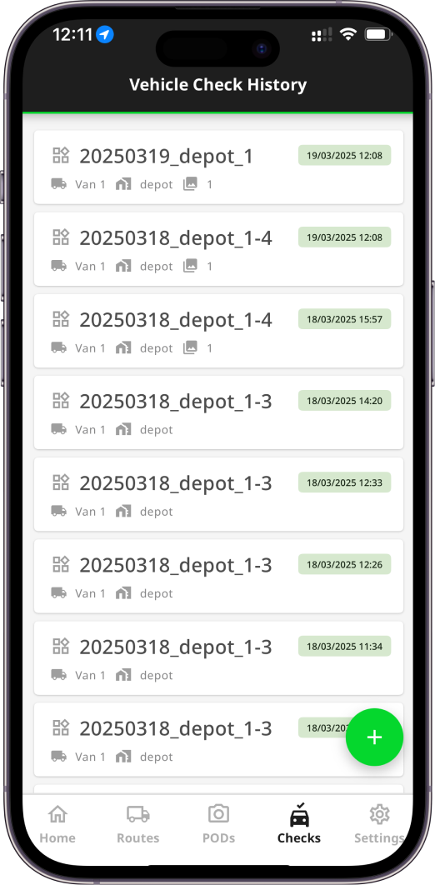

On Create vehicle check page, you will be asked to select a vehicle existing in your environment settings for which you want to create this check.  You also need to take or select photos of the vehicle (optional) and create a signature (optional).

To complete the creation, press the `Create` button.

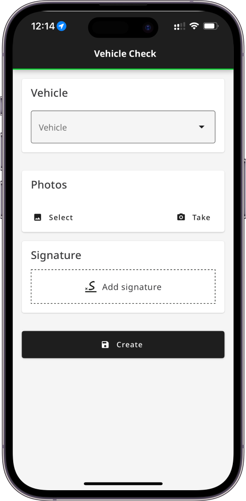

# Vehicle Checks History

The created Vehicle check will be stored on Vehicle Checks page in the mobile app as well as in Geo2 Hub:

[Mob Vehicle checks history.mp4](/wiki/download/attachments/27593284/Mob%20Vehicle%20checks%20history.mp4?version=1&modificationDate=1709638928925&cacheVersion=1&api=v2)

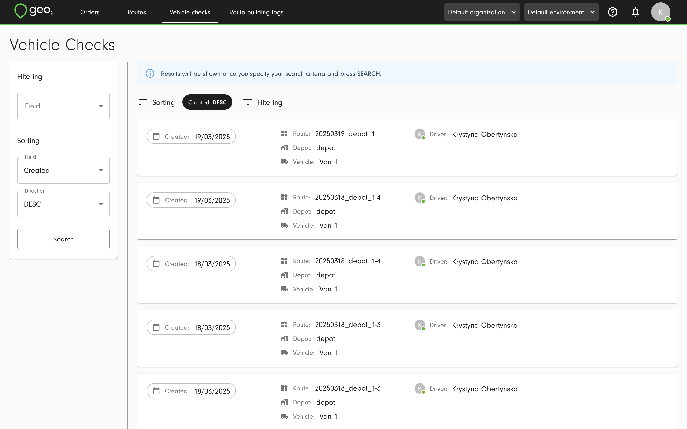

To view details of the vehicle check, you need to click on the Vehicle check card.

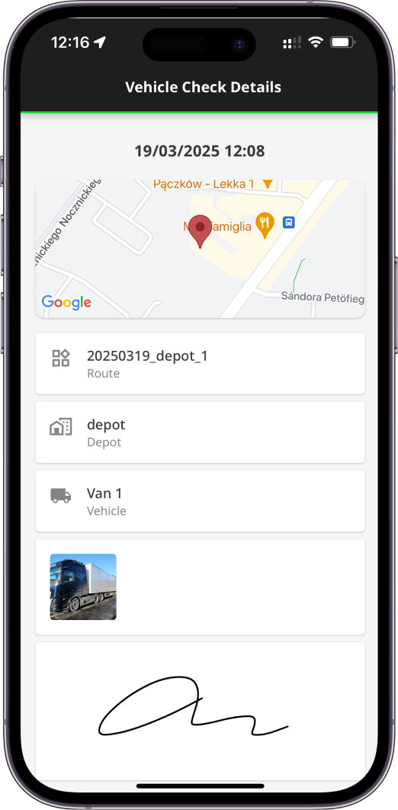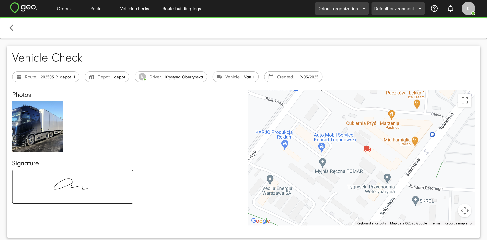

# Custom Vehicle Checks Fields

In the Environment settings, you can set up custom fields for Vehicle Checks to ask for needed information from a driver on a route starting and completion.  Learn how to create a vehicle check with custom fields:

[Mob Vehicle check custom fields.mp4](/wiki/download/attachments/27593284/Mob%20Vehicle%20check%20custom%20fields.mp4?version=1&modificationDate=1709639613395&cacheVersion=1&api=v2)

Examples of the custom fields from Environment settings:

- Ask for the vehicle registration number
- Ask if the damage is reported
- Ask for Mileage

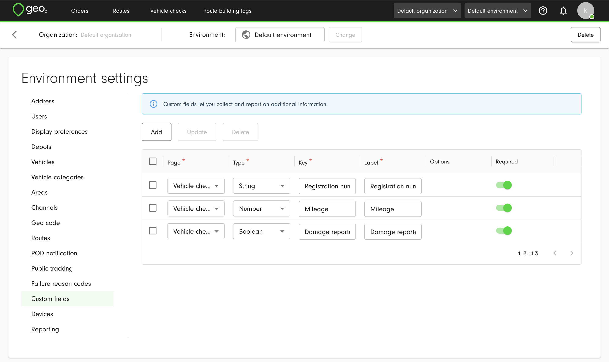

That's how it could look on Vehicle Check creation page: 

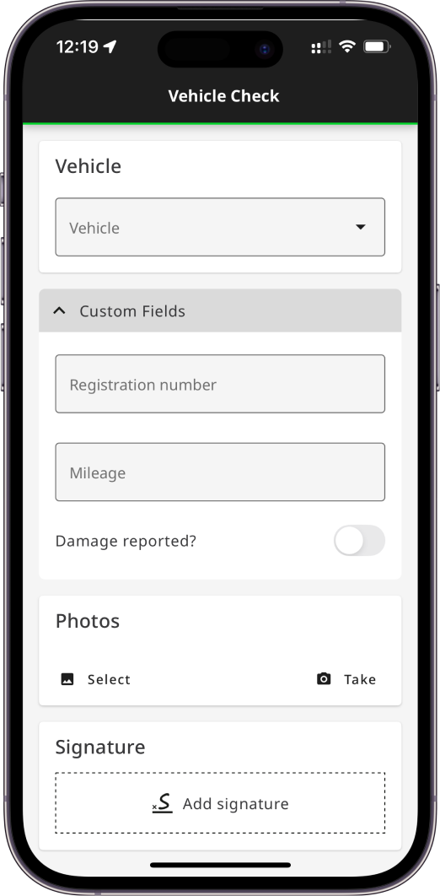

In Vehicle checks history it will be displayed this way:

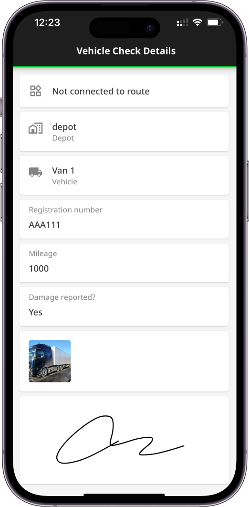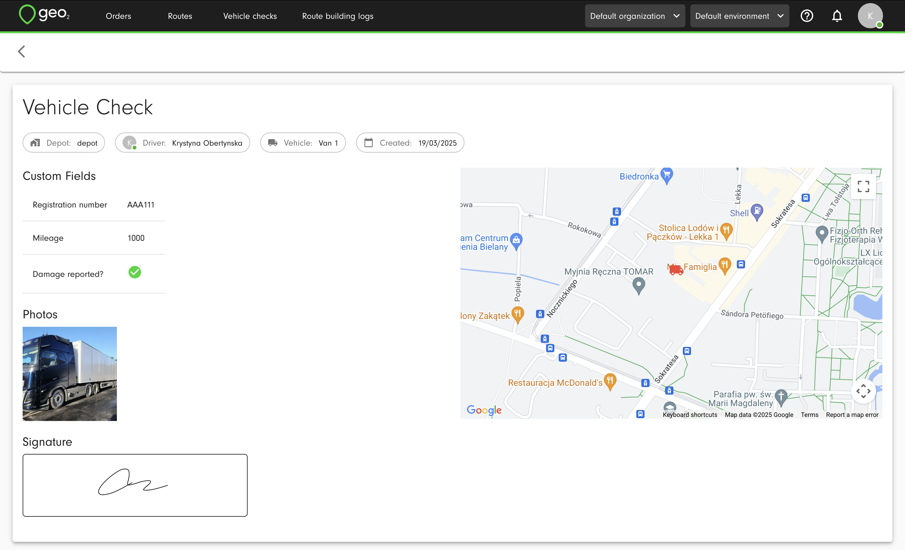
